:css: presentation.css
:skip-help: true
:data-transition-duration: 1000

.. title:: Introduction to Machine Learning

.. footer::

    Dr. Omri Har-Shemesh, data scientist @ |logo|

    .. |logo| image:: images/schmiede_logo_white.png
        :width: 190px

My talk at the University of Mauritius

----

:id: title-slide

Introduction to Machine Learning
================================

Dr. Omri Har-Shemesh
--------------------

30. August 2019, University of Mauritius
~~~~~~~~~~~~~~~~~~~~~~~~~~~~~~~~~~~~~~~~

----

:data-y: r1000

About me
========

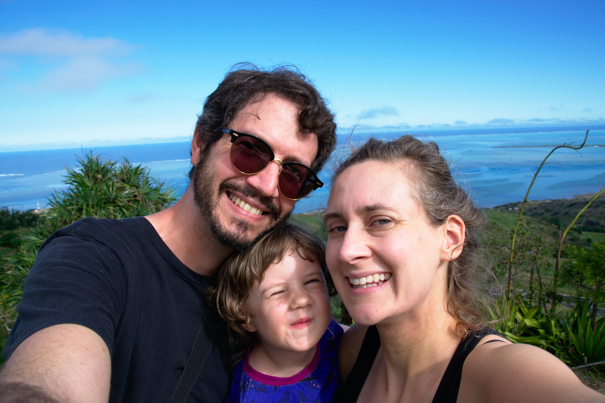

----

:id: background-physics

Background: M.Sc. in Physics
============================

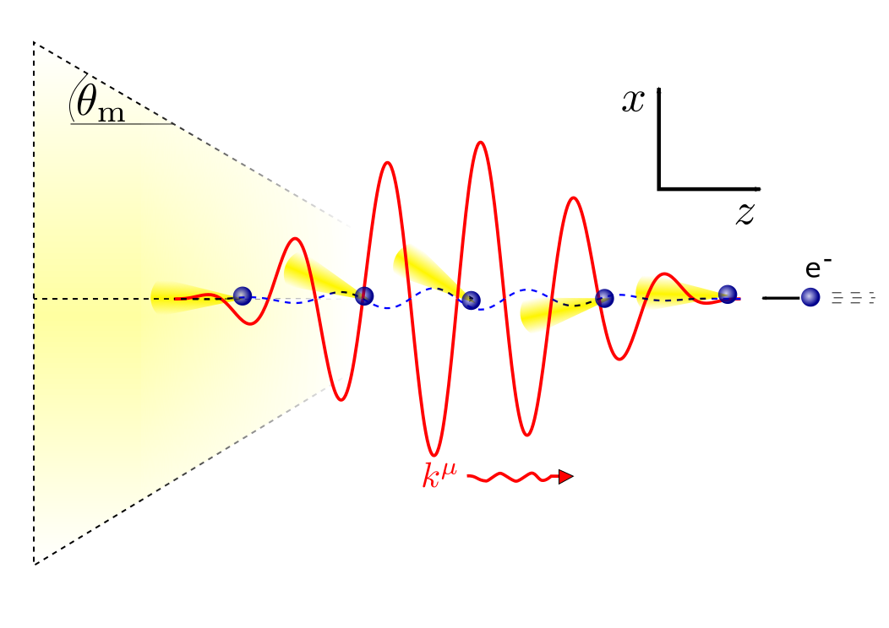

----

Background: Ph.D. in Computational Science
==========================================

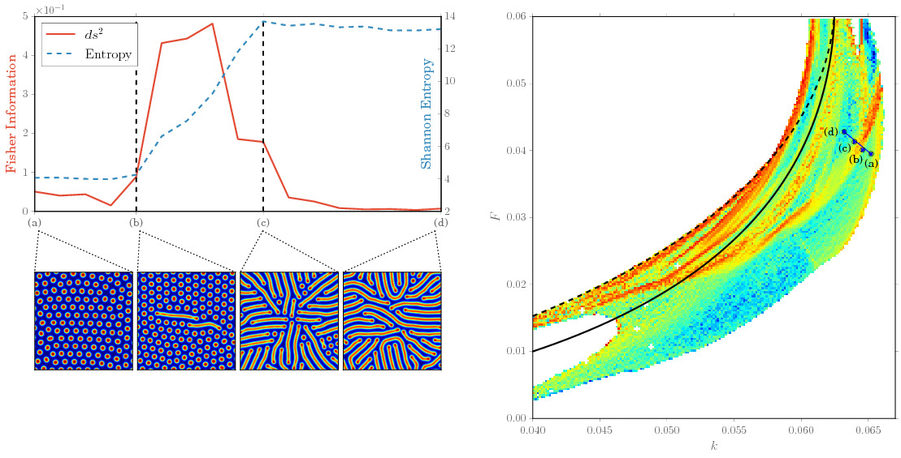

----

Current: Data Science / Programming @ schmiede.one
==================================================

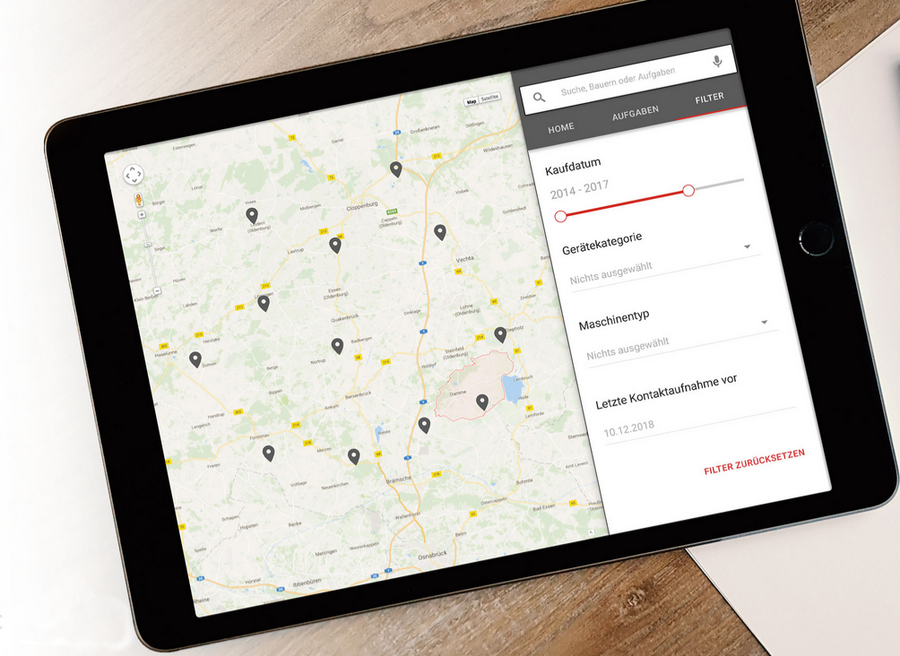

----

:data-rotate-y: 0
:data-x: 3000
:data-y: 0

Introduction to Machine Learning
================================

.. class:: substep

    Articifial Intelligence?

----

:data-rotate-y: 90
:class: wide-step

What about AI?
==============

.. class:: substep

    .. image:: images/ai_ml_dl.png
        :width: 1000px

----

:data-rotate-y: 90
:data-y: r1000

What about AI?
==============

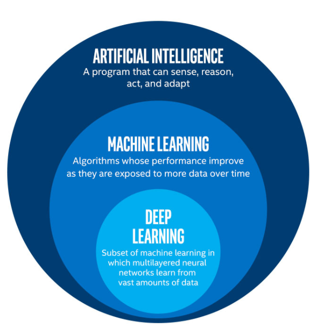

----

:data-rotate-y: 90
:data-y: r1000

What about AI?
==============

.. image:: images/ai-machine-learning-and-deep-learning.png
    :height: 500px

----

:data-y: 0

----

:data-rotate-y: 0

----

:data-y: r1000

So what is Machine Learning?
============================

.. raw:: html

    

    <blockquote>
    Machine Learning: Field of study that gives computers the ability to
    learn without begin explicitly programmed.
    </blockquote>
    <cite>Arthur Samuel (1959)</cite>
    

    

    <blockquote>A methodology and a collection of algorithms designed to 
    discover and exploit meaningful patterns in raw data.</blockquote>
    <cite>Omri Har-Shemesh (now)</cite>
    

----

:data-y: r1000

Is this possible?
=================

.. raw:: html

    <iframe class="substep" width="800" height="450" 
    src="https://www.youtube.com/embed/yQwfDxBMtXg" frameborder="0" 
    allow="accelerometer; autoplay; encrypted-media; gyroscope; 
    picture-in-picture" allowfullscreen></iframe>

----

:class: wide-step

Is this possible?
=================

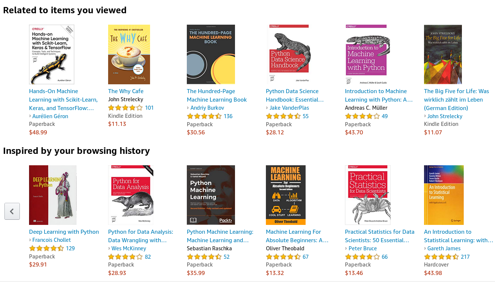

----

:class: very-wide-step

Is this possible?
=================

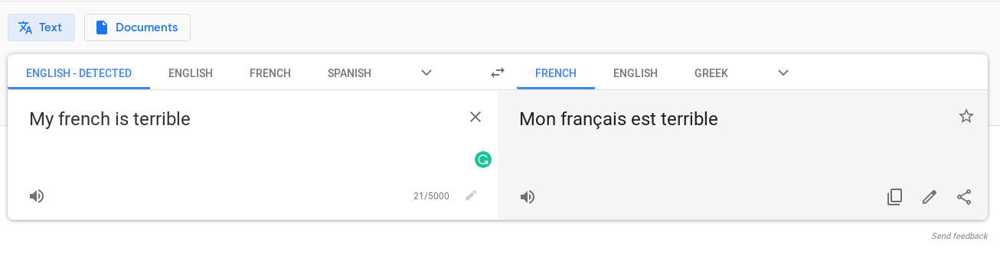

----

:class: very-wide-step

Is this possible?
=================

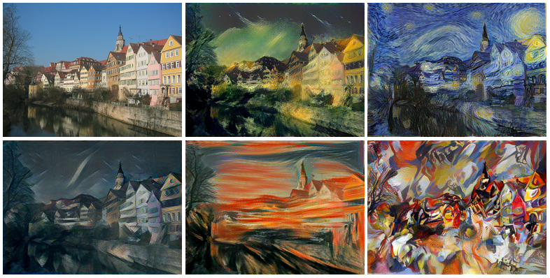

----

:class: very-wide-step

Is this possible?
=================

.. image:: images/horse2zebra.gif
    :width: 1800px

.. raw:: html

    <h1 class="substep" style="color:teal;font-weight:800">Yes!</h1>

----

:data-y: 0
:data-x: 5000

How is this possible?
=====================

.. raw:: html

    <h3 class="substep emphasis" style="padding-top: 100px;">
        Data  + Computing Power + Some Clever Ideas
    </h3>

----

:class: quite-wide-step
:data-y: r1000

What is data?
=============

.. raw:: html

    

        <ul class="left">
        <li class="substep"> Numbers (scalars, vectors, tensors)</li>

        <li class="substep"> Categories
        <ul>
            <li class="substep"> Yes/No</li>
             <li class="substep">Very satisfied / Satisfied / ... / Not 
             satisfied</li>
            <li class="substep"> Cat / Dog / Building</li>
            </ul>
        </li>

         <li class="substep">Images</li>
         <li class="substep">Sound</li>
         <li class="substep">Text</li>
     </ul>

     <ul style="color: teal;">
         <li class="substep">Web logs</li>
         <li class="substep">Financial records</li>
         <li class="substep">Website interactions</li>
         <li class="substep">Customer service contacts</li>
         <li class="substep">Social media interactions</li>
         <li class="substep">Machine logs</li>
         <li class="substep">Medical records</li>
         <li class="substep">...</li>
     </ul>
     

----

:class: wide-step

What is data?
=============

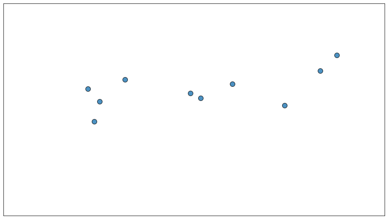

----

Three types of machine learning
===============================

.. class:: substep

    1. Supervised Learning

    2. Unsupervised Learning

    3. Reinforcement Learning

----

:class: wide-step

Supervised Learning
===================

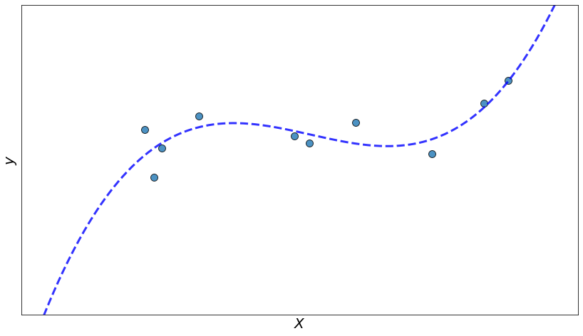

----

:class: wide-step

Unsupervised Learning
=====================

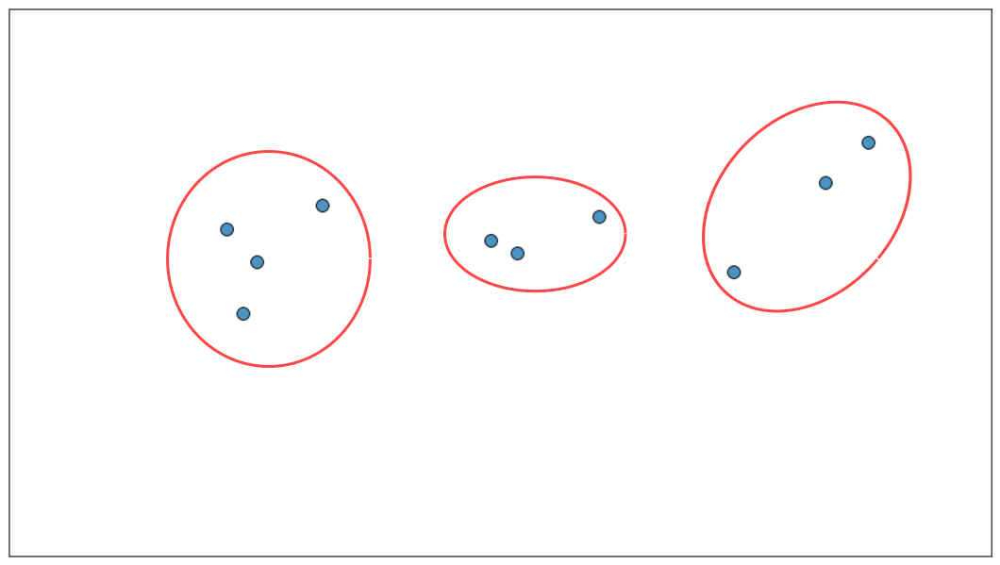

----

:class: wide-step

Reinforcement Learning
======================

.. image:: images/deepmind_parkour.0.gif
    :height: 500px

----

:class: very-wide-step white-back

.. image:: images/all_of_ml.png

----

Two types of supervised learning
================================

.. raw:: html

    <ol><li>
        Regression
        

            You're predicting a number
        

        </li>
        <li>
        Classification
        

            You're predicting a category
        

        </li>
    </ol>

----

Example: linear regression
==========================

* We have data

.. math:: X = [x_1, x_2, x_3, \ldots]

.. math:: y = [y_1, y_2, y_3, \ldots]

* We want to predict, for a given new :math:`X`, the appropriate :math:`y`.

----

Example: linear regression
==========================

.. class:: substep

    * First step - assume a model:

.. math:: y \sim aX + b + \epsilon
    :class: substep

.. class:: substep

    * Second step - define a loss function 

.. math:: L = \sum\limits_{i=1}^N (y_i - \hat{y}_i)^2
    :class: substep

----

:class: wide-step

Example: linear regression
==========================

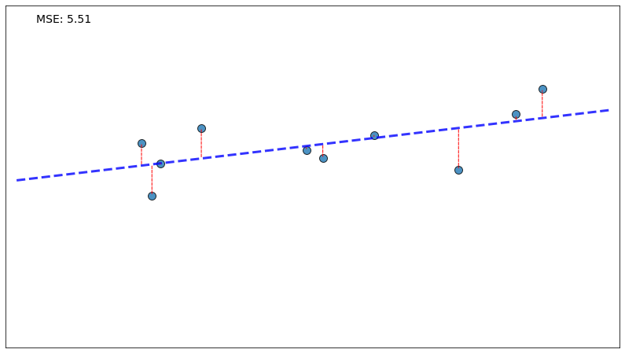

----

Example: linear regression
==========================

* First step - assume a model:

.. math:: y \sim aX + b + \epsilon

* Second step - define a loss function 

.. math:: L = \sum\limits_{i=1}^N (y_i - \hat{y}_i)^2

.. class:: substep
    
    * Third step - find parameters :math:`a` and :math:`b` that minimize 
      :math:`L`.

.. math:: \frac{\partial}{\partial a} L = 0 \\ \frac{\partial}{\partial b}L = 0
    :class: substep

----

:class: very-wide-step

Demo
====

----

Potential Problems
==================

.. class:: substep

1. Data too noisy

2. Model too simple (high bias / underfitting)

3. Model too complex (high variance / overfitting)

----

Bias-Variance Tradeoff
======================

.. math::
    
    E \left[ \left(y - \hat{f}(x)\right)^2 \right] = \left(E[\hat{f}(x)] - y 
    \right)^2 
    + E[\hat{f}^2(x)] - E[\hat{f}(x)]^2 + \sigma^2

----

What can we do?
===============

.. class:: substep

    1. If data is too noisy - get better data! You can't solve this with ML.

    2. If model too simple - complicate the model (easy).

    3. Model overfitting the data?
        * Use test set to know you're overfitting.

        * Penalized loss function.

        * Add more data (make it harder to overfit).

        * Fine tune the parameters of the model.

        * Model specific tricks (e.g. Dropout layers).

----

:class: very-wide-step white-back

Are we done?
============

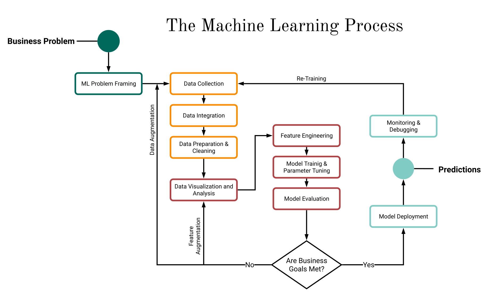

----

:data-scale: 7
:data-y: 3000
:data-x: 4000

----

:data-scale: 1
:data-y: 0
:data-x: 7000
:class: white-back

Introducing Python
==================

.. image:: images/pandas_logo.png
    :class: padded substep

.. image:: images/Scikit_learn_logo_small.svg
    :class: padded substep

----

:data-y: r1000

pandas
======

A great package for
-------------------

.. class:: substep

1. Data exploration

2. Data cleaning

3. Data wrangling

4. Data visualization (together with matplotlib)

5. Data preparation

----

:class: very-wide-step

scikit-learn
============

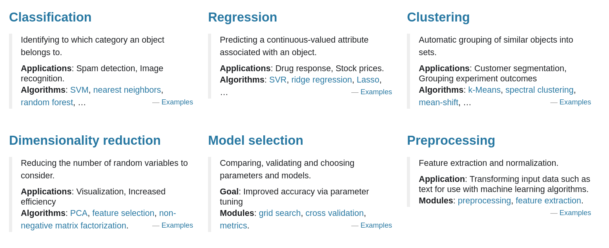

----

:class: quite-wide-step

scikit-learn: small demo
========================

.. code:: python
    :class: substep

    def generate_data(n_points=10, eps=0.1, seed=None):
        if seed:
            np.random.seed(seed)
        if n_points == None:
            X = np.linspace(-2.2, 3.2, 1000)
            n_points = 1000
        else:
            X = np.random.uniform(low=-2, high=3, size=n_points)
            np.sort(X)
        y = X**3 - 2 * X ** 2 + 1.5 ** X + 5 + eps * np.random.normal(size=n_points)
        return X, y

---- 

:class: quite-wide-step

scikit-learn: small demo
========================

.. code:: python

    # Simple Example - Linear regression with a linear feature set
    from sklearn.model_selection import train_test_split
    from sklearn.linear_model import LinearRegression

    X, y = generate_data(n_points=100, eps=2)
    X_train, X_val, y_train, y_val = train_test_split(X, y, test_size=0.1)

    model = LinearRegression()
    model.fit(X_train, y_train)

.. code:: python
    :class: substep

    prediction = model.predict(X)

.. code:: python
    :class: substep

    score = model.score(X_test, y_test)

---- 

:class: quite-wide-step

scikit-learn: small demo
========================

.. code:: python

    # Let's do the same with polynomial fit
    from sklearn.preprocessing import PolynomialFeatures

    pf = PolynomialFeatures(degree=3)
    pf.fit(X_train)
    X_train_poly = pf.transform(X_train)

    model = LinearRegression()
    model.fit(X_train_poly, y_train)

---- 

:class: quite-wide-step

scikit-learn: small demo
========================

.. code:: python

    # Or easier, combine them in a pipeline!
    from sklearn.pipeline import make_pipeline

    pipeline = make_pipeline(
        PolynomialFeatures(degree=3),
        LinearRegression()
    )

    pipeline.fit(X_train, y_train)
    pipeline.score(X_test, y_test)

---- 

:class: quite-wide-step

.. image:: images/ml_map.png
    :height: 800px

---- 

:class: quite-wide-step

.. image:: images/scikit-book.jpg
    :height: 800px

----

.. raw:: html

    <h1 style="color:darkred;font-weight:800;">A small challenge :)</h1>

----

:class: very-wide-step

And a small plug...
===================

.. image:: images/grandis.jpg
    :width: 1000px

----

:data-y: -2000
:data-x: 4000
:data-scale: 15

Thank you!
==========
